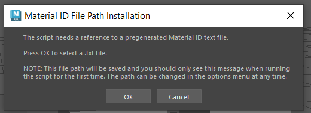
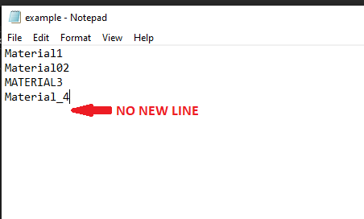
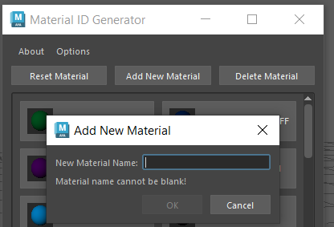
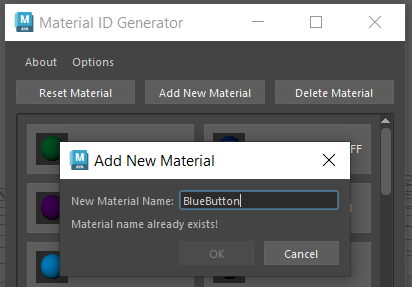
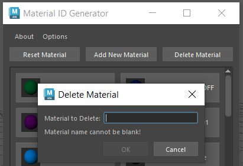
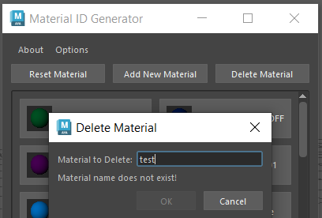
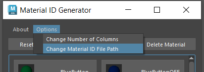
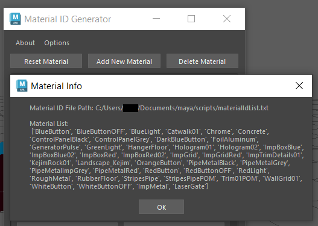

# Maya Tools and Scripts
This repo contains Maya scripts mostly written for developers and artists I'm working with for a game project - Kyber Initiative.
## Material ID Tool
The Material ID Tool allows a user to apply generated IDs to objects in Maya for visualization purposes and easy texture assignment when moving assets to other DCCs. The tool was originally created for asset migration to Unreal Engine 5 but is not restricted. 

Features include:
* Read, add, and delete predefined material IDs from a .txt file
* Automatically generate materials and shading groups with random colors for each ID
* Apply materials to objects with a single button click
* Reset object materials to default 'lambert1' if mistakes are made
* Select all objects with a specific material by right clicking the button

UI Features include:
* Buttons are labeled with color and ID for easy identification
* Button section in scrollable area so window can be resized to desired fit
* Change the number of columns in the button grid to user preference which is automatically saved and remembered for future use


### Installation

The script for the Material Id Tool is inside the scripts folder - ```materialId.py```

To utilize the script with Maya:
1. Save python file to your "scripts" folder in your project. For Windows users, this is usually in C:\Users\\[yourUser]\Documents\maya
2. Open the script editor in your scene. There are several ways: [MayaHelpScriptEditor](https://help.autodesk.com/view/MAYAUL/2023/ENU/?guid=GUID-7C861047-C7E0-4780-ACB5-752CD22AB02E)
3. Open the materialId.py script in the script editor and run

The script can also be saved to your shelf for easy access. Here is some Maya Documentation to save scripts to shelf: [MayaHelpSaveToShelf](https://help.autodesk.com/view/MAYAUL/2024/ENU/?guid=GUID-C693E884-F81A-4858-B5D6-3856EB8F394E). The imgs/icons folder in the repo also contains two versions of icons that can replace the default python icon in Maya: Crystal and Diamond Icons.

### On First Install
The script is built to read in the material IDs from an external text file. On first install, a popup will appear that asks the user to select the location of material ID file on their computer. Your material ID file can be saved anywhere. The script will save this file path so you should only see this message when running the script for the first time.



A File Dialog will open after clicking OK:


> [!WARNING]  
> This external file MUST be a text file. You will not be able to select anything but a text file.

The script expects a certain file structure in order to create the shaders. 

The file rules are as follows:
1. Must be a text file
2. Every new material ID must be on a **new line**. 
3. No empty lines can exist!!

The script will not run if it encounters any empty lines because the shader creation method cannot take an empty string. The script identifies every new material by searching for line breaks. I have included an ```example.txt``` for you to edit.

Here is an example of what the text file should look like:




### Changing Material ID Text File
You can manually change the text file at any time. Re-run the script after editing the file to see your changes reflected. Remember the rules of the file!

#### Add New Material
The script is able to add a new material to the pregenerated material ID text file through the 'Add New Material' button. This will open a popup where you can input the name of the new material. 



There are two safety measures to ensure a valid input:
1. User cannot add a name that is blank 
2. User cannot add a name that already exists. The name is case sensitive so "Material1" and "MATERIAL1" are considered different names. 

The OK button will be disabled and error messages displayed in each situation.



After selecting a valid name and clicking OK, the main UI will refresh (this may take a second and the UI will flash), the new material will be created and a new button will be visible at the END of the button list.

#### Delete Material
The script is able to delete a material to the pregenerated material ID text file through the 'Delete Material' button. This will open a popup where you can input the name of the material.



There are two safety measures to ensure a valid input:
1. User cannot delete a name that is blank 
2. User cannot delete a name that does not exist

The OK button will be disabled and error messages displayed in each situation.




#### Changing File Path
You can change the file path to the material ID text file at any time via the 'Change Material ID File Path' option under the Options menu. This will open a file dialog where you can select a new text file.




### Generate Materials
When you run the script, it will generate all the materials and shader groups for the IDs predefined in the list that do not already exist. It will also generate shading groups/shading engine for each material so that they apply to objects correctly. The script searches the names of the existing materials and shading groups to determine if they already exist.

It will assign random colors to each material. There is a random seed defined so each artist that runs the script will generate the same random colors for each material. This can be edited in the code if desired.

### Apply and Reset Materials
To apply a material, simply select the object(s) that you want to apply the material to. Then, click the button that corresponds to the material you want to apply. Any existing material on the object will be overwritten by the selected material. This will also work for faces and/or parts of an object. If no objects are selected, the script will return an error: ```No renderable object is selected for assignment```.

Resetting materials before clicking the newly desired is not necessary. However, if you want to return the object to Maya's default state, use the "Reset Material" button. The "Reset Material" button returns the object's material to Maya's default 'lambert1'. 

### Select All Objects with Specific Material
To select all objects with a specific material, simply right click on the button that corresponds to the material you want to select for. All objects that have that material applied will be selected in the viewport. This will also work for faces and/or parts of an object. Any previous selections will be cleared. If no objects have that material, nothing will occur. 

### Status Tips for UI
When hovering over each button, a helpful status tip will show at the bottom left of the Maya Window to remind users of how to activate apply versus select actions. 

Here is an example:


### Change Number of Columns for the Button Grid
The first time the script is run, the UI will default to 2 columns for the button grid. However, this can be changed under the "Options" menu in the UI.


A new window will open asking for your preference and the main UI will close. This allows the script to re-build the UI once the user selects a new number. Clicking "OK" will save the new number as the number of columns for the button grid. Clicking "Cancel" will result in no changes.

This number is saved in settings so the most recently set number will be what is used every time the script runs, until changed again.

### Show Info About Materials
In the 'About' menu, click 'Show Material Info' to find information about the values used in the script. 
It currently displays the following:
1. File path to the pregenerated material ID text file
2. List of all materials




### Features to Add
TODO:

* ~~Add context menu to select all objects with a specific material~~ DONE
* ~~Fix hardcoding materials by reading from file instead~~ DONE
* ~~Add a "add new material" button that appends to file~~ DONE
* ~~Add "delete material" button that removes from file~~ DONE
* Add error handing for selection if no objects have that material

## License
[MIT](https://choosealicense.com/licenses/mit/)
